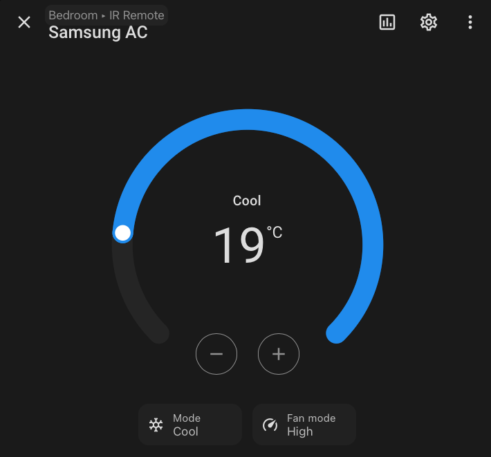

# ESPHome Samsung Wall AC IR

[English](README.en.md)



자취방용 삼성 벽걸이 에어컨용 ESPHome 외부 컴포넌트입니다.
`AR06M1130HZ`모델의 IR 패킷을 기준으로 작성되었습니다.

## 지원 기능

- 전원 OFF
- 냉방 모드
- 팬 1/2/3단계
- 온도 16~32도

## 참고

- [정리](notes.md)
- [캡처 데이터](capture/)
- [변경 내역](CHANGELOG.md)


## 사용법

```yaml
...
external_components:
  - source:
      type: git
      url: https://github.com/jiheon2234/esphome-samsung-wall-ac-ir
      ref: v0.0.2
...
```

